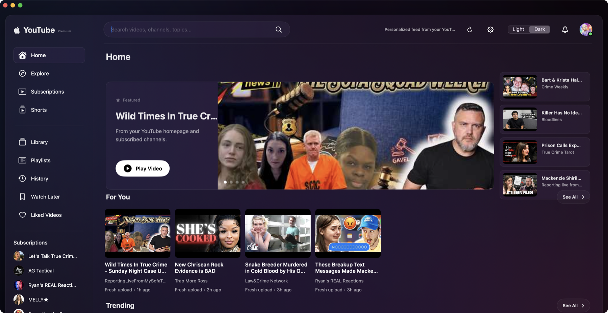

# YouGlass

YouGlass is a native Apple Silicon macOS YouTube client with an Apple-inspired liquid-glass interface, native navigation, an in-app player, desktop Picture in Picture, account-aware feeds, and a Sparkle update channel.




## Install

Download the latest arm64 `.dmg` or `.zip` from the [GitHub Releases page](https://github.com/appleforever11/YouGlass/releases), move `YouGlass.app` to `/Applications`, and launch it. The release build targets Apple Silicon Macs, including the MacBook Neo and M4 Mac mini, and requires macOS 14 or later.

After installation, use **YouGlass > Check for Updates...** to check the GitHub-hosted Sparkle appcast. Updates are downloaded only from signed release assets.

## What ships

- Native SwiftUI/AppKit desktop shell with dark and light appearance.
- Google/YouTube sign-in session handling with credentials stored in the macOS Keychain.
- Account-aware home, subscriptions, channels, search, comments, live chat, likes, saves, and playback state where YouTube grants access.
- In-app player, captions, scrubber, desktop Picture in Picture, and resume position.
- Sparkle 2.9.5 update support with an Ed25519-signed GitHub release feed.

## Build locally

```sh
swift package resolve
./script/test.sh
./script/build_and_run.sh
```

The test script stages Sparkle for SwiftPM's test runner before running the test suite. The build script stages a complete `.app` bundle, including `Sparkle.framework` and its updater helpers. `./script/build_and_run.sh --verify` builds, launches, and verifies the signed bundle. `./script/package_dmg.sh` creates the installable DMG. `./script/package_release.sh 1.0.0` creates the Sparkle-compatible arm64 ZIP.

## Version policy

YouGlass follows Semantic Versioning:

- `1.0.0` is the first GitHub release.
- `1.0.x` is for bug fixes, reliability work, security fixes, and compatibility patches.
- `1.x.0` is for backward-compatible features and user-facing improvements.
- `2.0.0` is reserved for breaking changes, migration requirements, or a new update channel.

Every version must have a matching file in [`RELEASE_NOTES/`](RELEASE_NOTES/) and a matching `CFBundleShortVersionString`/`CFBundleVersion` in `Sources/YouTubeMac/Info.plist`. The release notes are embedded in the Sparkle appcast and are also used as the GitHub release notes.

See [VERSIONING.md](VERSIONING.md) for the complete release checklist.

## Release automation

Pushing a tag such as `v1.0.1` runs [the release workflow](.github/workflows/release.yml). It builds an arm64 release, signs the app, creates the ZIP and DMG, generates the Sparkle appcast, and publishes the GitHub release. The workflow expects Developer ID and notarization credentials in GitHub Actions secrets; those secrets are never stored in this repository.

The Sparkle Ed25519 private key is intentionally not included in Git. Keep the local copy in the macOS Keychain or in a password-protected secret named `SPARKLE_PRIVATE_KEY`. Only the public key belongs in `Info.plist`.

## Repository safety

OAuth tokens, API keys, client-secret JSON files, signing keys, build products, and local Codex metadata are ignored. YouGlass reads account credentials from the macOS Keychain at runtime; no account credentials should be committed to this repository.
