# YouGlass 2.3 screenshot tour

Captured from the rebuilt native macOS app. Video availability and recommendations vary with the YouTube session. Screenshots show real app surfaces, not design mockups.

## Home

YouTube Home order when available, with bounded local discovery as a fallback.

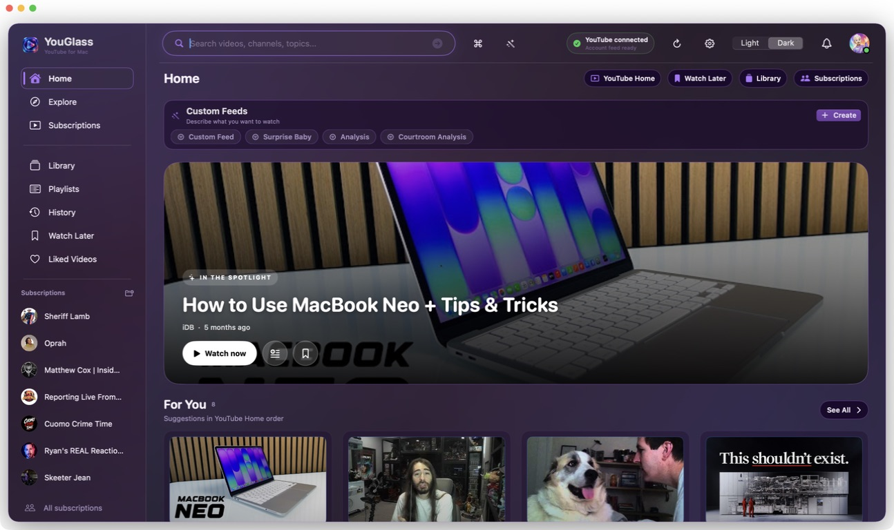

## Explore and search

Choose a topic and open real YouTube results in the native grid.

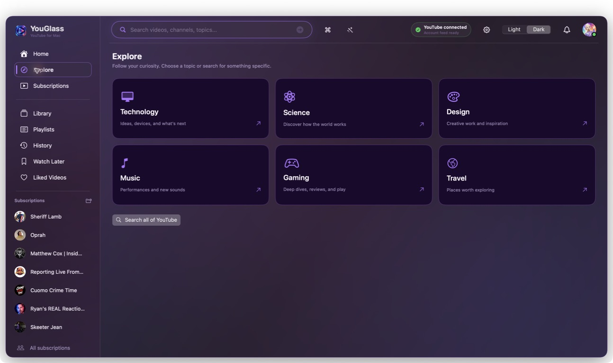

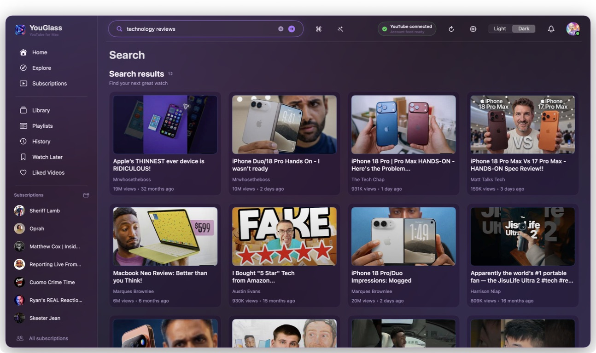

## Library

Resume checkpoints, saved and liked videos, collections, and timestamped notes.

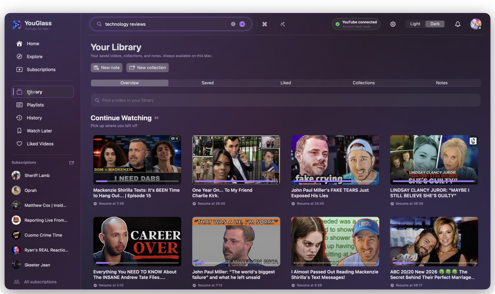

## Channels and subscription groups

Native channel browsing and local channel organization.

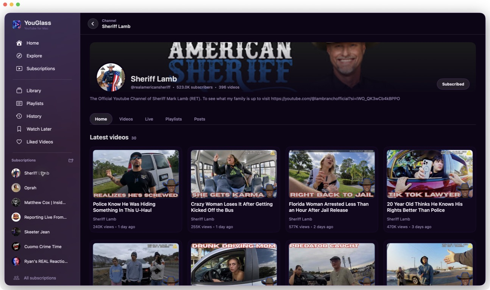

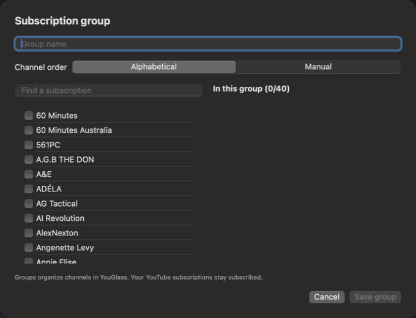

## Player and queue

Native playback, captions, contextual Up Next, and an ordered playback queue.

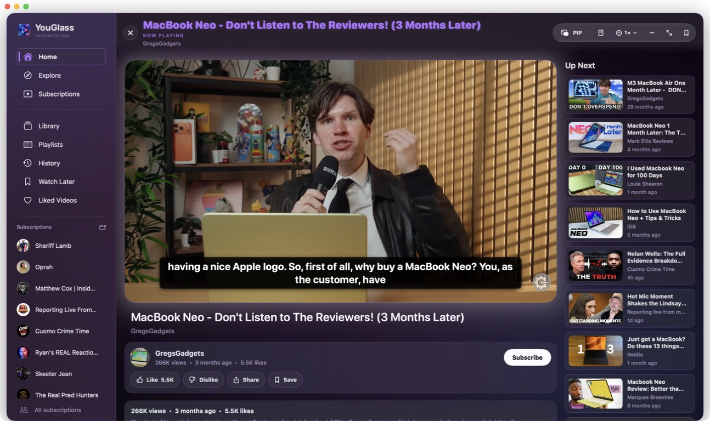

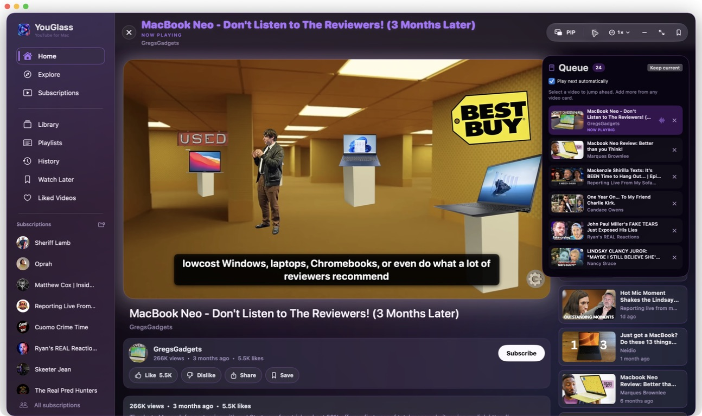

## Desktop Picture in Picture

Floating video with native captions and playback controls.

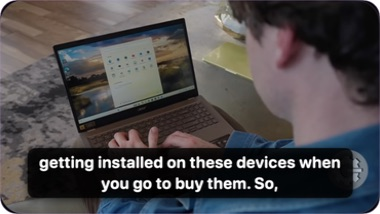

## In-window mini-player

Keep browsing while the video and captions play above Home.

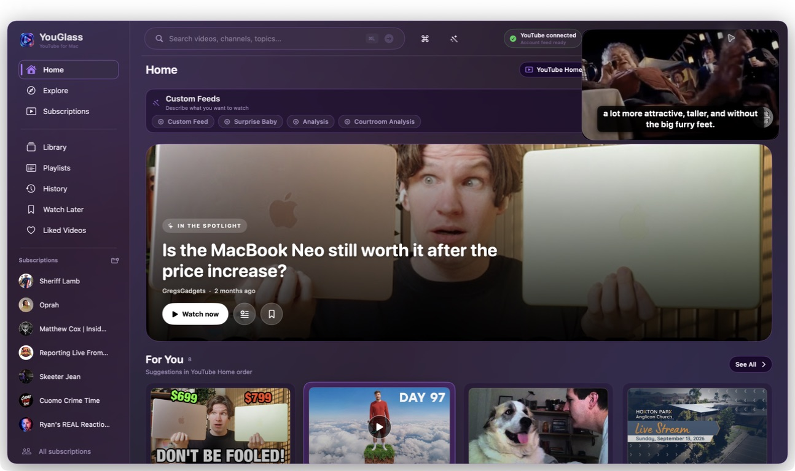

## Custom Feeds

Describe an interest and preview the query before saving a local feed.

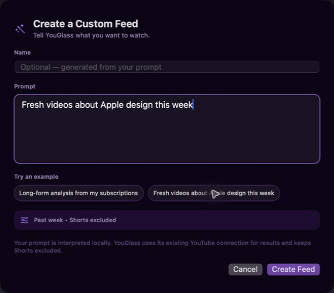

## Command palette

Keyboard access to playback, navigation, Library, and Custom Feeds.

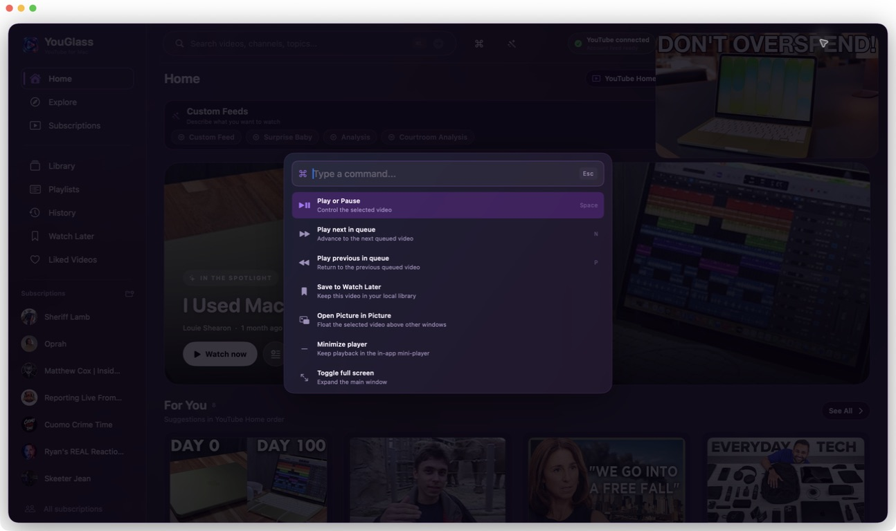

## Appearance

Twenty-four environments with coordinated Light and Dark palettes.

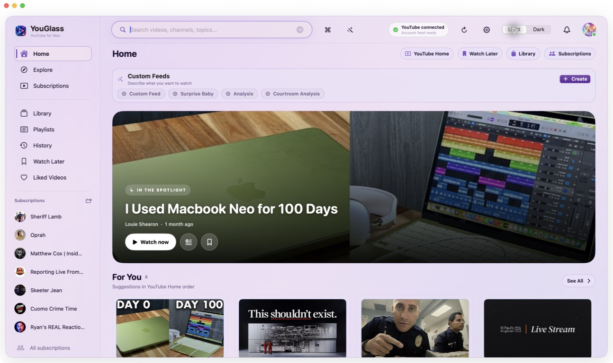

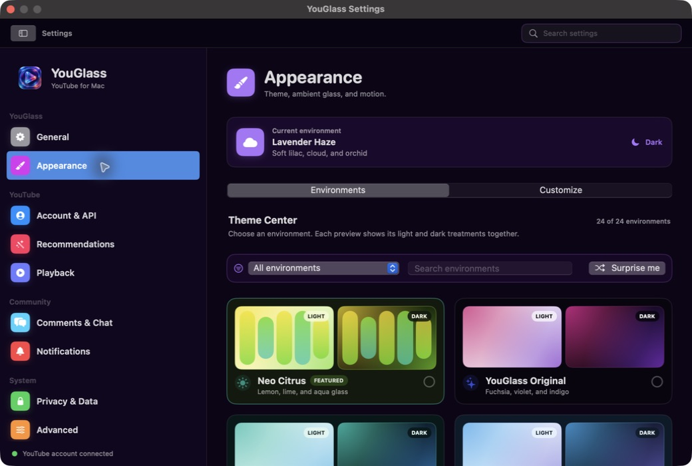

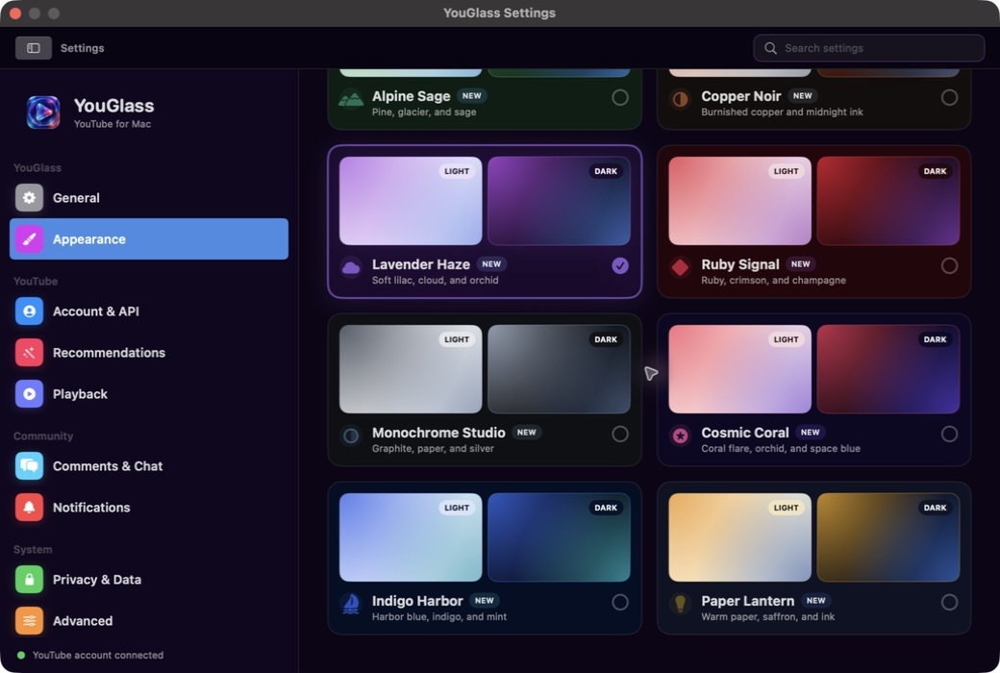

## Settings

App version, connection status, and playback preferences.

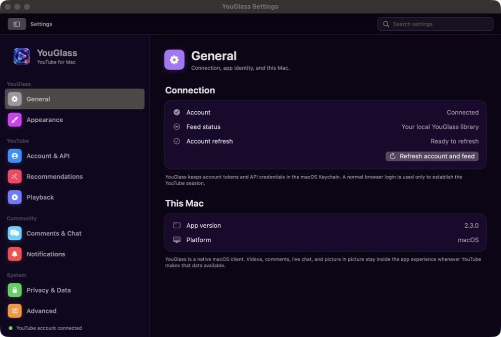

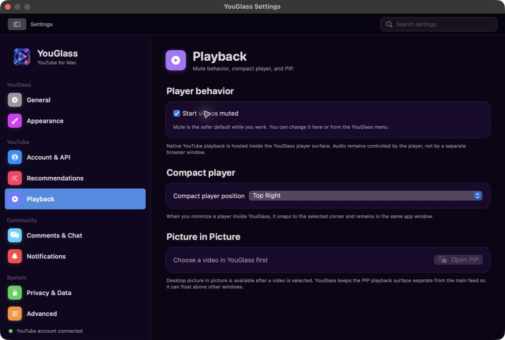

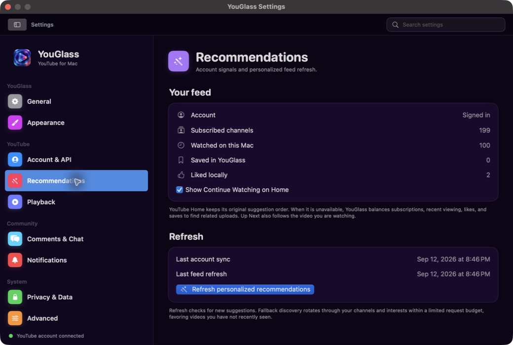
